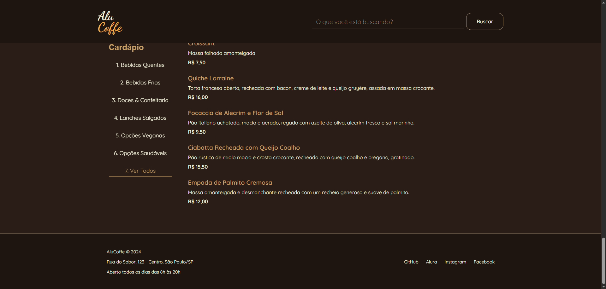

# ☕ AluCoffe - Cardápio Digital Interativo

**`🌟 Visão Geral do Projeto`**

**AluCoffe** é um projeto de **cardápio digital interativo** desenvolvido para uma cafeteria fictícia. O objetivo principal deste projeto é demonstrar proficiência em desenvolvimento **front-end moderno** utilizando exclusivamente **HTML5, CSS3 e JavaScript puro (Vanilla JS).**

A aplicação simula um ambiente de menu eletrônico, oferecendo uma experiência de usuário fluida através de carregamento dinâmico de dados, navegação por categorias e busca em tempo real. É ideal para quem busca exemplos práticos de manipulação de DOM e consumo de dados JSON sem o uso de frameworks.

---

### 🤖 Linguagens e Tecnologias

\\
---

### ✨ Funcionalidades Principais

| Funcionalidade                     | Descrição                                                                                                                                                                                                 | Palavras-chave de Otimização (SEO)                                   |
|-----------------------------------|-------------------------------------------------------------------------------------------------------------------------------------------------------------------------------------------------------------|----------------------------------------------------------------------|
| Carregamento Dinâmico             | Os itens do cardápio são renderizados diretamente a partir de um arquivo **data.json**, garantindo facilidade na manutenção, escalabilidade e separação de preocupações (dados vs. apresentação).            | JavaScript JSON, Carregamento Dinâmico HTML, Menu Scalable          |
| Filtragem por Categoria           | Permite ao usuário navegar facilmente por seções específicas como “Bebidas Quentes”, “Doces”, “Opções Veganas” e outras, otimizando a usabilidade.                                                         | Filtragem de Menu, Filtro de Categoria JS, UX Design                |
| Busca em Tempo Real (Live Search) | Uma barra de pesquisa robusta filtra os resultados instantaneamente conforme o usuário digita, proporcionando feedback imediato e encontrando produtos específicos rapidamente.                             | Busca em Tempo Real JavaScript, Live Search Vanilla JS, Função de Pesquisa Front-End |
| Design Responsivo                 | A interface foi construída com Flexbox para se adaptar perfeitamente a qualquer tamanho de tela, garantindo acessibilidade e usabilidade em desktops e dispositivos móveis (Mobile First).                 | Design Responsivo CSS, Mobile First Web Design, HTML Responsivo Flexbox |

---

### 🛠️ Tecnologias Utilizadas

Este projeto foi construído com uma stack puramente front-end, focada em performance e leveza:

**HTML5:** Estruturação semântica e acessível do conteúdo.

**CSS3 (Puro):** Estilização, criação de layouts responsivos (Flexbox) e aplicação de temas modernos.

**JavaScript (ES6+):** Programação das lógicas de manipulação do DOM, consumo do JSON e implementação de todas as funcionalidades interativas (filtros e busca).

---

### 🚀 Como Executar Localmente

Este é um projeto front-end estático e não requer backend ou dependências complexas (como Node.js).

**1. Clone o Repositório:**

git clone [https://github.com/SeuUsuario/alucoffe-cardapio-digital.git](https://github.com/SeuUsuario/alucoffe-cardapio-digital.git)
cd alucoffe-cardapio-digital

2 .Abra o Arquivo:
Simplesmente abra o arquivo index.html em seu navegador de preferência (Chrome, Firefox, Edge, etc.).

**💡 Dica:** Para uma simulação local mais fiel, você pode usar a extensão "Live Server" no VS Code ou executar um servidor web simples (ex: python3 -m http.server) na raiz do projeto.

---

### 📂 Estrutura de Arquivos

alucoffe-cardapio-digital/

├── index.html          # Estrutura principal do cardápio

├── styles.css          # Estilização completa da aplicação (CSS3)

├── script.js           # Lógica JavaScript (Manipulação do DOM, Filtros, Busca)

└── data.json           # Fonte de dados do cardápio (Itens, Categorias, Preços)

---

### 🤝 Contribuições

Sinta-se à vontade para sugerir melhorias, reportar bugs ou adicionar novas funcionalidades!

Faça um Fork do projeto.

Crie uma Branch para sua funcionalidade (git checkout -b feature/NovaFuncionalidade).

Faça Commit de suas mudanças (git commit -m 'Adiciona NovaFuncionalidade').

Faça Push para a Branch (git push origin feature/NovaFuncionalidade).

Abra um Pull Request.

